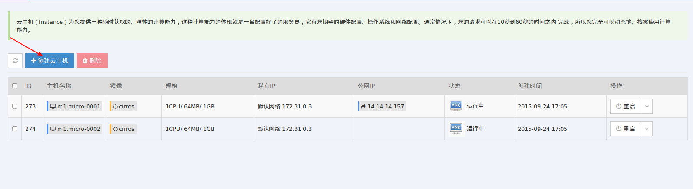
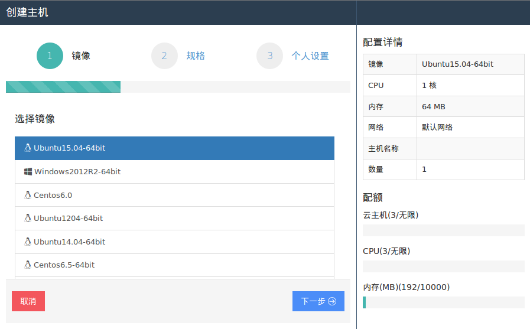
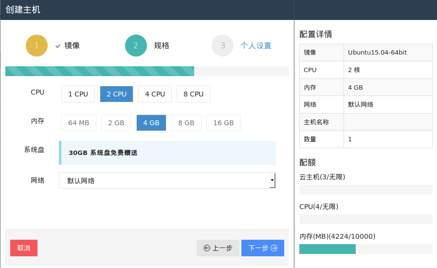
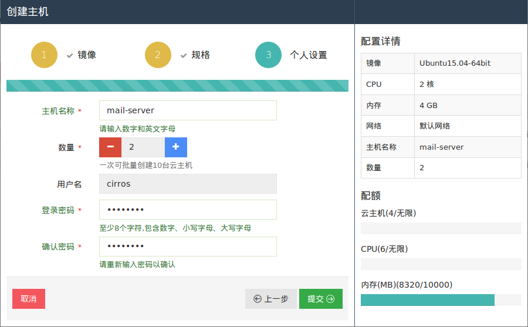

# 云主机

>云主机（Instance）为您提供一种随时获取的、弹性的计算能力，这种计算能力的体现就是一台配置好了的服务器，它有您期望的硬件配置、操作系统和网络配置。通常情况下，您的请求可以在10秒到60秒的时间之内 完成，所以您完全可以动态地、按需使用计算能力。

## 创建云主机

1. 选择镜像
    

    
    
创建云主机-选择镜像

2. 选择配置
    
    
创建云主机-选择配置

3. 基础信息  
    
    
创建云主机-个人设置

    选择完成后点击提交按钮。

## 云主机功能

### VNC登录

### 绑定公网IP
>**公网IP**为静态互联网IP地址。在易用云系统中，您可以把申请到的IP地址绑定私有网络中的主机或路由器中，并可以随时解绑，或者分配到别的主机，路由器上，从而更灵活的使用互联网。 